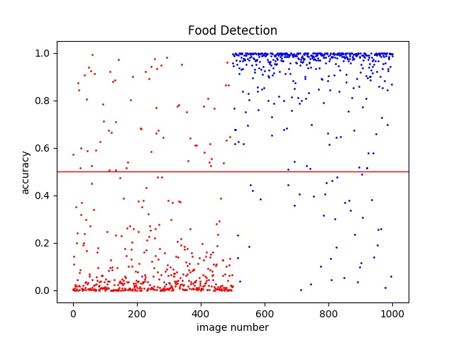

Food-nonFood binary Classification
===================================
using keras
----------

binary Classification은 기존 Classification과 다르게 결과가 0과 1 둘 중 하나로 분류되어야 합니다.

입력 이미지를 음식사진인지, 음식사진이 아닌지 판별하기 위해 binary Classification을 Keras를 이용한
Convolution Neural Network (CNN) 으로 구현하였습니다. 

#binary_img_data
---------------

학습을 위한 이미지가 저장된 directory 입니다.

training directory 은 학습을 위한 이미지 데이터셋 입니다.

validation directory는 검증을 위한 이미지 데이터셋입니다.

model
-----
학습을 통해 만들어진 네트워크 모델을 저장하는 폴더입니다.

numpy_data
-----------
전처리를 통해 이미지를 배열 형태로 만들어 저장한 폴더입니다.

pedict_binary_img_with_CNN.py
-----------------------------
이미지를 불러와 학습을 시킨 후 모델을 저장하고 검증 데이터셋의 결과를 출력합니다.

학습 과정에서 loss와 accuracy의 변화 과정을 그래프로 만들어 data.jpg 파일로 저장합니다.

var_accuary = 94%

check_img.py
------------
학습이 진행되는 파일이 아니고 이미 만들어져 있는 모델을 불러와 검증데이터 셋의 결과를 보여줍니다.

각데이터의 결과를 분산 그래프로 만들어 result.jpg로 저장합니다.
검증 정확도 92%

